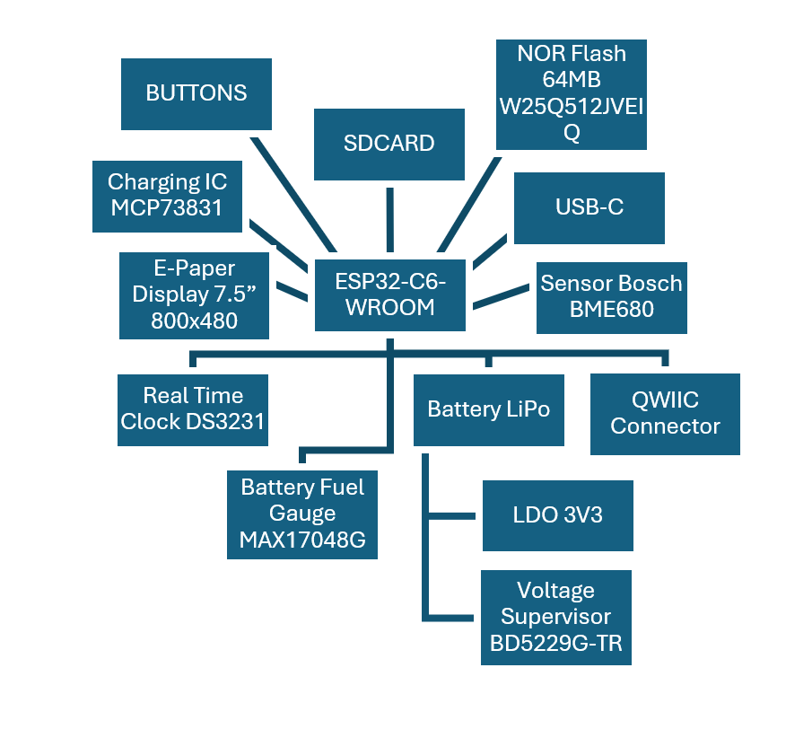

E-readerul implementat integrează mai multe module esențiale, inclusiv ESP32-C6, un modul RTC, senzori de mediu, 
conectivitate USB-C, un slot pentru card MicroSD și un sistem de gestionare a bateriei. 
Toate componentele comunică prin interfețe standard precum I²C, SPI, UART și GPIO analogice/digitale.

Controler de încărcare – MCP73831
Tip baterie: Li-ion/Li-Po cu o singură celulă

Curent de încărcare: Programabil până la 500 mA

Interfață: Standalone (fără I²C/SPI)

Tensiune de intrare: 3.75 V – 6 V

Ieșire stare: Indicație a stării de încărcare prin LED

Senzor de mediu – BME688
Măsurători: Temperatură, umiditate, presiune, gaze (VOC, calitatea aerului)

Interfață: I²C, SPI

Interval temperatură: -40 °C – +85 °C

Senzor de gaze: Detecție AI a amestecurilor de gaze și VOC

Consum de energie: Ultra redus (ideal pentru dispozitive mobile/wearables)

Display e-paper
Interfață: SPI

Rezoluție: 800×480

Consum de energie: Foarte redus (consum doar în timpul actualizării)

Caracteristici: Lizibil excelent în lumină solară, unghiuri largi de vizualizare

Conector Qwiic
Tip: Conector JST SH cu 4 pini (1.0 mm)

Scop: Interconectare I²C standardizată pentru senzori/module

Tensiune: Logică de 3.3 V

Pini: SDA, SCL, VCC, GND

Conector card memorie – 112A-TAAR-R03
Tip: Slot pentru card MicroSD

Interfață: SPI sau SDIO

Tensiune: Logică 3.3 V

Caracteristici: Mecanism push-push, contact pentru detectare card

Utilizare: Stocare de date, redare media

Microcontroler – ESP32-C6-WROOM-1-N8
Procesor: RISC-V pe 32 de biți, până la 160 MHz

Memorie: 512 KB SRAM intern, 8 MB flash extern (W25Q512JVEIQ)

Conectivitate: Wi-Fi 6 (802.11ax), Bluetooth 5 (LE), IEEE 802.15.4 (Thread/Zigbee), USB 2.0 (Full-Speed)

Periferice: SPI, I²C, UART, PWM, ADC, mai mulți pini GPIO

Memorie externă – W25Q512JVEIQ
Capacitate: 512 Mbit (64 MB)

Interfață: Quad SPI (QPI)

Frecvență de operare: Până la 133 MHz

Tensiune de alimentare: 2.7 V – 3.6 V

Caracteristici: rezistență mare (100.000 cicluri scriere/ștergere)

Ceas în timp real – DS3231SN#
Precizie: ±2 ppm între 0°C și +40°C

Interfață: I²C

Caracteristici: Oscilator cu cristal compensat termic (TCXO) integrat

Tensiune de funcționare: 2.3 V – 5.5 V

Funcționalități suplimentare: suport pentru baterie de rezervă, 2 alarme programabile, ieșire pătrată 1Hz

Monitor baterie – MAX17048G+T10
Funcție: Indicator de încărcare pentru baterii Li-ion/Li-Po cu o singură celulă

Interfață: I²C

Tensiune: 2.5 V – 4.5 V

Consum de putere: Curent de repaus ultra-redus (~23 µA)

ESP32-C6 Pin description
  EN -> Resets the MCU
  IO0 - INT_RTC -> Used to receive interrupts signals from RTC, allowing for two major functionalities: Alarm and Square Wave Output
  IO1 - 32KHz -> Used for a stable clock signal of 32.768 kHz generated by the RTC
  IO2 – MISO -> Master In Slave Out Signal, used in the SPI communication with the SD Card
  IO3 - EPD_BUSY -> Indicates display driver status
  IO4 – SS_SD -> Chip select for SPI communication with SD Card
  IO5 – EPD_DC -> Display serial communication Command/Data input
  IO6 – SCK -> Clock signal for I2C communication
  IO7 – MOSI -> Master Out Slave In Signal, used to send data to display and SD Card
  IO8 - GPIO8 - Controls MCU boot mode
  IO9 - IO/BOOT -> Used to detect BOOT button press
  NC -> Not connected
  3V3 -> Used to power the MCU and the other components
  IO10 - EPD_CS -> Chip select for SPI serial communication with the display
  IO11 - FLASH_CS -> Chip select for SPI communication with the flash
  IO12 - USB_D- -> Used in USB differential communication
  IO13 - USB_D+ -> Used in USB differential communication
  IO15 - IO/CHANGE -> Used to detect CHANGE button press
  TXD0/GPIO16 - TX -> Sends data to another device via UART
  RXD0/GPIO17 - RX -> Receives data from another device via UART
  IO18 - RTC_RST -> Resets the RTC
  IO19 - I2C_PW -> Power source for I2C components
  IO20 - EPD_3V3_C -> Display IO voltage supply
  IO21 - SDA -> Used to send and receive data in the I2C communication with the sensor, RTC module and Battery Fuel Gauge
  IO22 - SCL -> Clock signal for I2C communication
  IO23 - EPD_RST -> Global reset signal for the display
  GND -> Shared Voltage Reference

[📋 Download BoM](./Manufacturing/Bill%20of%20Materials.csv)
